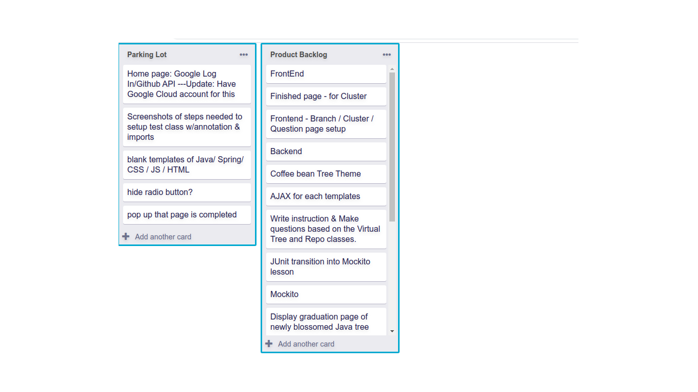

# Simple-Trello-Copy

## Description

Create a lookalike of a Trello board (see reference image) with the given list of cards. The project scaffolding is provided, and the list of cards is in the `App` component. Implement the `Board` component that takes the `listOfCards` as props and renders it. Create as many sub-components as you want.

**important**

- Do not change the shape of the data(listOfCards)
- You may add additional lists but make sure to include the given `Parking Lot` and `Product Backlog` lists.
- Do not change the location of the `Board` component

  

