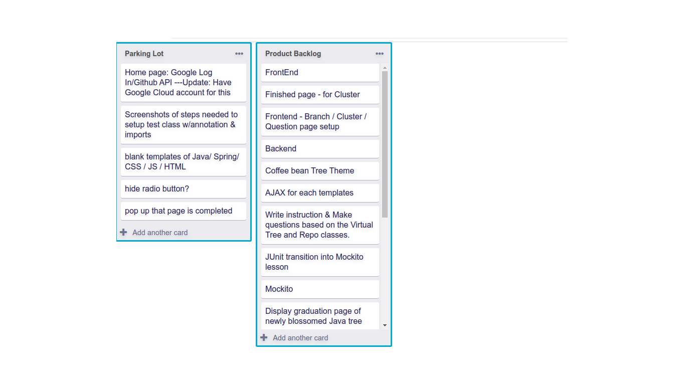

# Simple-Trello-Copy

**trello-copy-exercise**
* Arbeite daran, eine einzelne Liste von Karten zu rendern. Für mehr Übung kannst du mehrere Kartenlisten nebeneinander darstellen.
 

[//]: # (autograding info start)
## Ergebnisse

[🔬 Ergebnisdetails](https://github.com/DigitalCareerInstitute/SPA-component-trello-copy/actions)

[📢 Feedback geben oder Problem melden](https://docs.google.com/forms/d/e/1FAIpQLSfS8wPh6bCMTLF2wmjiE5_UhPiOEnubEwwPLN_M8zTCjx5qbg/viewform?usp=pp_url&entry.652569746=SPA-component-trello-copy&entry.2115011968=https%3A%2F%2Fgithub.com%2FDigitalCareerInstitute%2FSPA-component-trello-copy)

### Debugging deines Codes
> [Lesen der Testausgaben](https://github.com/DCI-EdTech/autograding-setup/wiki/Reading-test-outputs)

Es gibt zwei Möglichkeiten, um herauszufinden, warum Aufgaben nicht erledigt werden können:
#### 1. Tests lokal ausführen
- Führe `npm install` aus
- Führe `npm test` im Terminal aus. Du wirst sehen, wo deine Lösung vom erwarteten Ergebnis abweicht.

#### 2. Überprüfen der Testausgabe auf GitHub
- Gehe auf die [Registerkarte Aktionen deines Übungsrepos](https://github.com/DigitalCareerInstitute/SPA-component-trello-copy/actions)
- Dort siehst du eine Liste mit den Testläufen. Klicke auf den obersten.
- Klicke auf "Autograding".
- Erweitere den Punkt 'Run DCI-EdTech/autograding-action@main'
- Hier siehst du alle Ausgaben des Testlaufs

[//]: # (autograding info end)